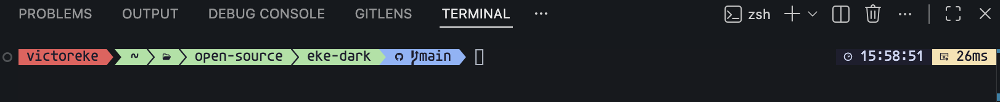

# Eke Dark

A two-tone chrome color theme with teal accents and fully-colored syntax. (Also includes light variants.)


## Why

Eke Dark exists for two reasons:

**1. Consistency across IDEs.** I usually switch between VS Code and JetBrains IDEs, and just needed something consistent across both IDEs. Eke Dark is being built as a single visual language across both — VS Code first, [JetBrains version in progress](#jetbrains-version).

**2. The default JetBrains syntax highlighting leaves too many tokens uncolored.** Local variables, parameters, simple identifiers, and many properties render at the default foreground color — effectively white in dark themes, black in light themes. The result is large blocks of code where only keywords, strings, and a handful of other tokens carry color, and everything else blurs together. Eke Dark colors those tokens distinctly so the structure of code is visible at a glance.

The chrome takes visual cues from [JetBrains' Islands theme][islands] — the two-tone separation between editor and surrounding panels, the calm restrained palette. The syntax scheme is built from scratch around the principle that _every meaningful token should have a color_.

## Variants

Eke Dark ships four variants. The non-italic versions are the default — they work with any monospace font. The italic versions render comments, parameters, static methods, and a few other tokens in italic, and require a font with proper italic glyphs (see [Recommended Setup](#recommended-setup)).

| Variant              | Editor BG | Description                                                    |
| -------------------- | --------- | -------------------------------------------------------------- |
| **Eke Dark**         | `#191a1c` | Two-tone dark chrome with teal accents                         |
| **Eke Dark Italic**  | `#191a1c` | Eke Dark with italic syntax for comments, parameters, statics  |
| **Eke Light**        | `#ffffff` | Clean light variant with matching teal accents                 |
| **Eke Light Italic** | `#ffffff` | Eke Light with italic syntax for comments, parameters, statics |

## Features

- **Two-tone UI chrome** — sidebar/panel darker than editor, activity bar/status bar darkest. Pushes chrome back, brings code forward.
- **Teal accent (`#4ECDC4`)** — cursor, active tab underline, focus borders, buttons, badges, links. Never in syntax.
- **Fully-colored syntax** — no token left at the foreground color. Variables, parameters, properties, and identifiers each get their own hue.
- **Semantic highlighting** — LSP-driven token colors with full `semanticTokenColors` support.
- **Bracket pair colorization** — gold, magenta, blue cycling.
- **Comprehensive language support** — TypeScript, JavaScript, Python, Rust, PHP, CSS/SCSS, JSON, YAML, Markdown, and more.

## Syntax Palette (Dark)

| Element                    | Color                                                | Hex       |
| -------------------------- | ---------------------------------------------------- | --------- |
| Keyword / Storage          |  | `#E5A070` |
| Function                   |  | `#6BBAFF` |
| Method                     |  | `#6DBCFF` |
| String                     |  | `#7FCC85` |
| Number                     |  | `#3CC8D4` |
| Class / Type / Variable    |  | `#42D4BA` |
| Interface / Type Parameter |  | `#28D6C6` |
| Property / Constant        |  | `#E08FD4` |
| Comment                    |  | `#7a7e85` |
| Decorator                  |  | `#CCC76E` |
| RegExp                     |  | `#58D8E8` |
| Tag (HTML)                 |  | `#6BB0EA` |

## Installation

### From the Marketplace

1. Open **Extensions** sidebar in VS Code (`Cmd+Shift+X`)
2. Search for `Eke Dark`
3. Click **Install**
4. Open the Command Palette (`Cmd+Shift+P`) → **Preferences: Color Theme** and pick one of the four Eke variants


### Manual install

If you'd rather not use the Marketplace, you can install Eke Dark as a local extension.

1. Clone the repo into your VS Code extensions folder:

   ```bash
   # macOS / Linux
   git clone https://github.com/Evavic44/eke-dark.git ~/.vscode/extensions/eke-dark

   # Windows (PowerShell)
   git clone https://github.com/Evavic44/eke-dark.git $env:USERPROFILE\.vscode\extensions\eke-dark
   ```

2. Restart VS Code.
3. Open the Command Palette → **Preferences: Color Theme** and pick an Eke variant.


## Recommended Setup

VS Code themes can only control colors and a few font styles (italic, bold, underline). Font family and size live in your editor settings, not the theme. Eke Dark is designed as a full visual setup — the typography below is what the colors are tuned against.

### Fonts

**Editor / Markdown / CodeLens** — [Google Sans Code][google-sans-code]

**Terminal** — [Agave Nerd Font Mono][nerd-fonts]

> [!NOTE]
> The terminal font is specifically chosen for [Oh My Posh][oh-my-posh] support — the Nerd Font patch provides the icon glyphs Oh My Posh themes use for git branches, status indicators, and segment separators. If you don't use Oh My Posh (or any Nerd Font prompt), plain Agave or any monospace font will do.



**Alternatives** if Google Sans Code isn't your taste: [JetBrains Mono][jetbrains-mono], [Geist Mono][geist-mono], or [Cascadia Code][cascadia-code] — all free, all have true italics.

### Suggested `settings.json`

Open the Command Palette → **Preferences: Open User Settings (JSON)** and add:

```jsonc
{
  // Editor
  "editor.fontFamily": "Google Sans Code, Menlo, 'Courier New', monospace",
  "editor.fontSize": 13,
  "editor.fontLigatures": true,
  "editor.semanticHighlighting.enabled": true,
  "editor.codeLensFontFamily": "Google Sans Code, Menlo, 'Courier New', monospace",

  // Terminal
  "terminal.integrated.fontFamily": "Agave Nerd Font Mono, Menlo, 'Courier New', monospace",
  "terminal.integrated.fontSize": 13,

  // Markdown preview
  "markdown.preview.fontFamily": "Google Sans Code, Menlo, 'Courier New', monospace",
}
```

The fallback chain (`Menlo, 'Courier New', monospace`) keeps things readable if the primary font isn't installed.

## Development

```bash
git clone https://github.com/Evavic44/eke-dark.git
cd eke-dark
code .

# Press F5 to launch Extension Development Host
# Select an Eke Dark variant from the Color Theme picker
```

Use **Developer: Inspect Editor Tokens and Scopes** to inspect TextMate scopes and semantic tokens for any element.

## Credits

- **[Islands theme][islands]** by JetBrains — chrome inspiration: two-tone separation, calm palette, the overall "softer, lighter" approach to UI.
- **[Yo Code][yo-code]** by Microsoft — the Yeoman generator used to scaffold this extension.
- **[Google Sans Code][google-sans-code]** — recommended editor font.
- **[Agave][agave]** by Blob — base font for the recommended terminal setup.
- **[Nerd Fonts][nerd-fonts]** — the patching project that produces Agave Nerd Font Mono with icon glyphs.
- **[Oh My Posh][oh-my-posh]** — the prompt engine the terminal font is tuned for.

<!-- LINKS -->

[islands]: https://blog.jetbrains.com/platform/2025/12/meet-the-islands-theme-the-new-default-look-for-jetbrains-ides/
[yo-code]: https://code.visualstudio.com/api/get-started/your-first-extension
[google-sans-code]: https://fonts.google.com/specimen/Google+Sans+Code
[agave]: https://github.com/blobject/agave
[nerd-fonts]: https://www.nerdfonts.com/
[oh-my-posh]: https://ohmyposh.dev/
[jetbrains-mono]: https://www.jetbrains.com/lp/mono/
[geist-mono]: https://vercel.com/font?type=mono
[cascadia-code]: https://github.com/microsoft/cascadia-code
